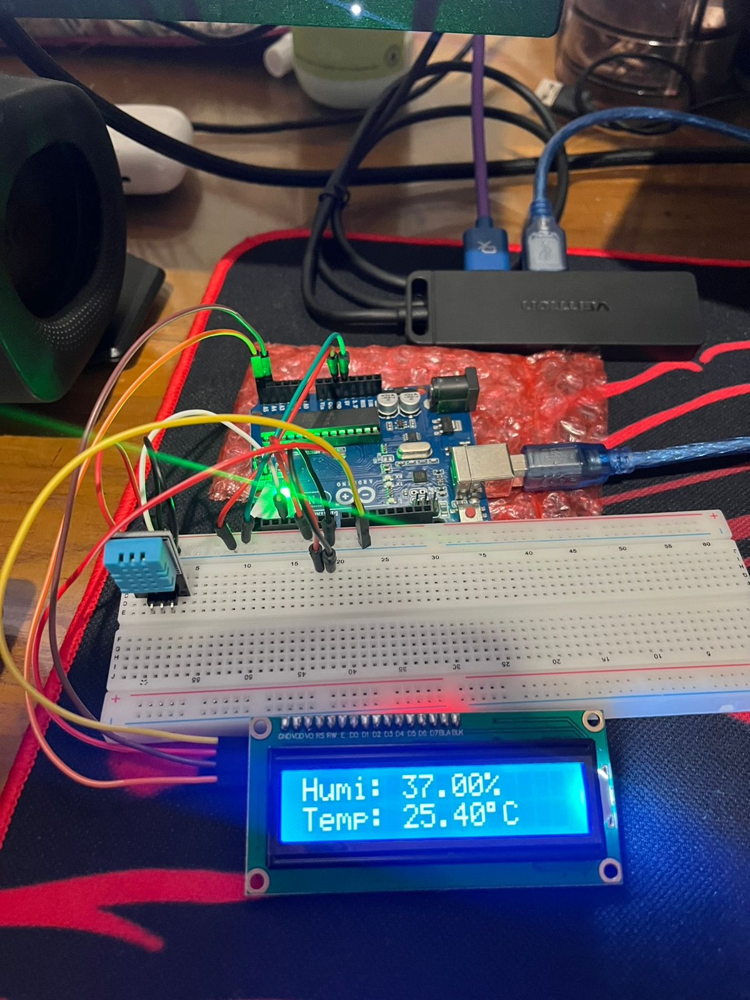
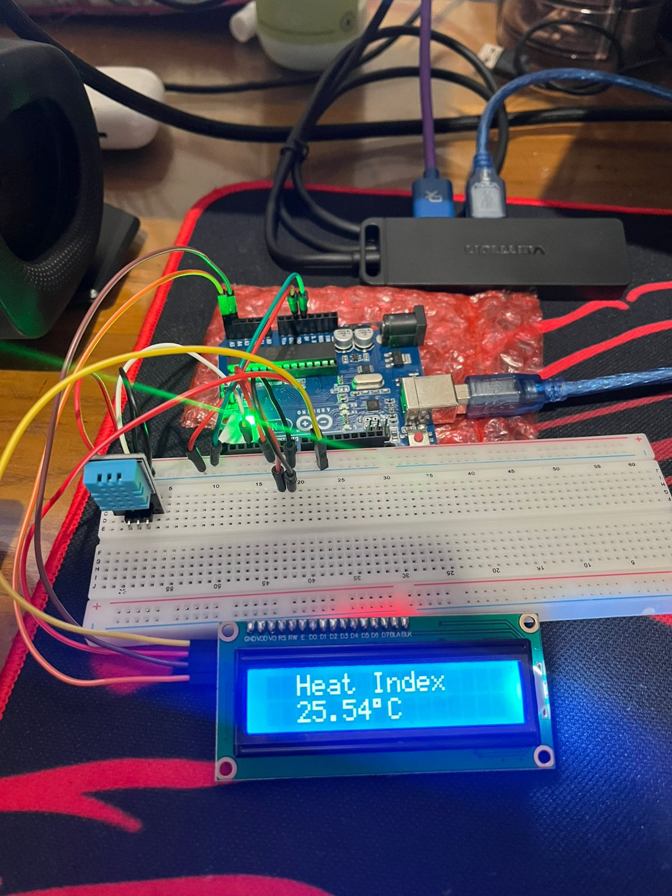
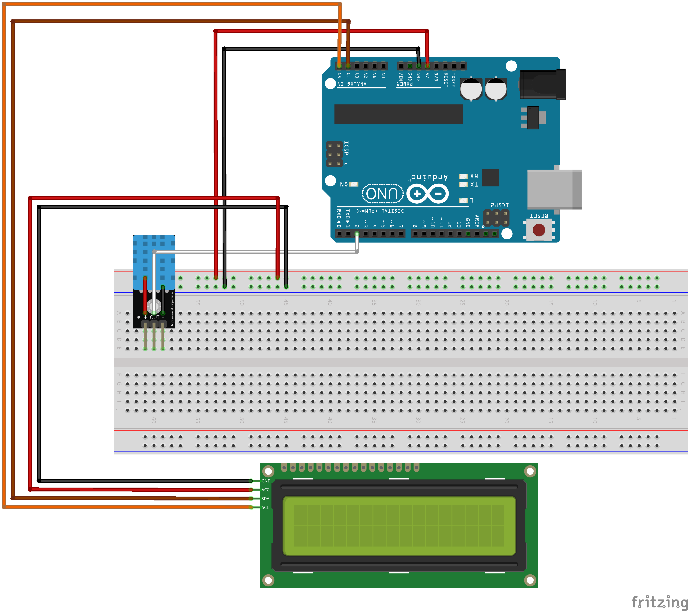

# Temperature and Humidity Detector with Arduino UNO

This project demonstrates how to build a simple and effective temperature and humidity monitoring system using an Arduino UNO, a DHT11 sensor, and an I2C LCD display. The device reads the ambient temperature and relative humidity, calculates the heat index, and displays the information on a 16x2 LCD screen.

## Final Product

Here's a look at the finished project in action, displaying the real-time temperature, humidity, and calculated heat index.

| Temperature & Humidity Reading | Heat Index Reading |
| :----------------------------: | :------------------: |
|  |  |

## Features

-   Real-time monitoring of temperature in Celsius.
-   Real-time monitoring of relative humidity.
-   Calculation and display of the heat index.
-   Easy-to-read output on a 16x2 LCD display.

## Components Required

-   1 x Arduino UNO R3
-   1 x DHT11 Temperature and Humidity Sensor (on a breakout board)
-   1 x 16x2 LCD Display with I2C module
-   1 x Half-size Breadboard
-   A set of Jumper Wires (Male-to-Male)
-   1 x USB Cable to power and program the Arduino

## Schematic and Wiring

The circuit is assembled according to the Fritzing diagram below. The connections are straightforward, utilizing the I2C interface for the LCD to minimize the number of pins used.



### Wiring Connections

Here is a detailed breakdown of the pin connections:

| Component         | Pin | Connects to Arduino |
| ----------------- | :-: | :------------------ |
| **DHT11 Sensor** | `+` | `5V`                |
|                   | `out`| `Digital Pin 2`     |
|                   | `-` | `GND`               |
| **I2C LCD Display**| `GND` | `GND`               |
|                   | `VCC` | `5V`                |
|                   | `SDA` | `Pin A4 (SDA)`      |
|                   | `SCL` | `Pin A5 (SCL)`      |

## Software and Setup

The project is programmed using the **Arduino IDE**. You will need to install a few libraries to interface with the DHT sensor and the I2C LCD display.

### 1. Install Arduino IDE

If you don't have it already, [download and install the Arduino IDE](https://www.arduino.cc/en/software) from the official website.

### 2. Install Required Libraries

You can install these libraries directly from the Arduino IDE's Library Manager. Go to **Sketch** > **Include Library** > **Manage Libraries...** and search for the following:

-   `DHT sensor library` by Adafruit
-   `LiquidCrystal_I2C` by Frank de Brabander

### 3. Upload the Code

Open the `.ino` sketch file in the Arduino IDE. Make sure you have the correct board (**Arduino Uno**) and port selected under the **Tools** menu. Then, click the upload button.

```cpp
#include <LiquidCrystal_I2C.h>
#include <DHT.h>

#define DHTPIN 2
#define DHTTYPE DHT11

DHT dht(DHTPIN, DHTTYPE);
LiquidCrystal_I2C lcd(0x27, 16, 2);

void setup() {
  lcd.init();
  lcd.clear();
  lcd.backlight();

  lcd.setCursor(2, 0);
  lcd.print("Temperature & Humidity");

  lcd.setCursor(6, 1);
  lcd.print("Detector");
  delay(2000);
  lcd.clear();

  dht.begin();
}

void loop() {
  delay(2000);
  float h = dht.readHumidity();
  float t = dht.readTemperature();

  if(isnan(h) || isnan(t)) {
    lcd.setCursor(0, 0);
    lcd.print("Failed to read  ");
    lcd.setCursor(0, 1);
    lcd.print("from DHT sensor!");
    return;
  }
  
  lcd.clear();
  lcd.setCursor(0, 0);
  lcd.print("Humi: ");
  lcd.print(h);
  lcd.print("%  ");
  
  lcd.setCursor(0, 1);
  lcd.print("Temp: ");
  lcd.print(t);
  lcd.print((char)223);
  lcd.print("C  ");

  //heat index
  float hic = dht.computeHeatIndex(t, h, false);
  delay(3000);

  lcd.clear();
  lcd.setCursor(0, 0);
  lcd.print("  Heat Index  ");
  lcd.setCursor(0, 1);
  lcd.print("  ");
  lcd.print(hic);
  lcd.print((char)223);
  lcd.print("C    ");
  
}
```

## How It Works

-   The **DHT11 sensor** measures the temperature and humidity from the surrounding air and sends a digital signal to the Arduino.
-   The **Arduino** reads this data, processes it, and also calculates the heat index, which is a measure of how hot it really feels when relative humidity is combined with the air temperature.
-   The **I2C LCD Display** receives the processed information from the Arduino via the I2C protocol and displays it for the user to see. The display cycles between showing the temperature/humidity and the heat index.
